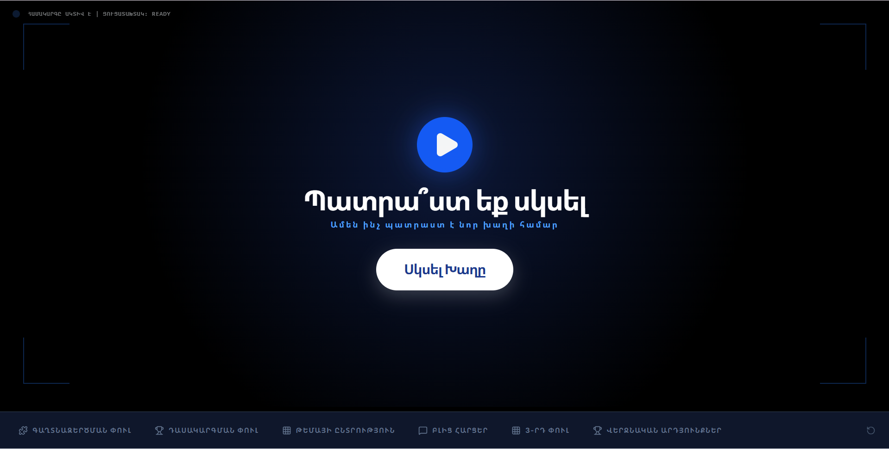
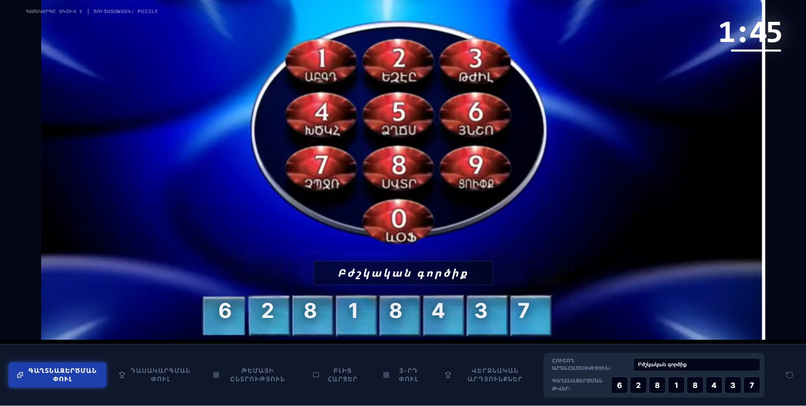
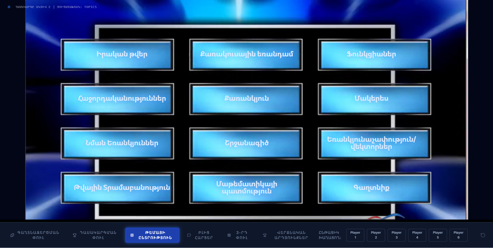
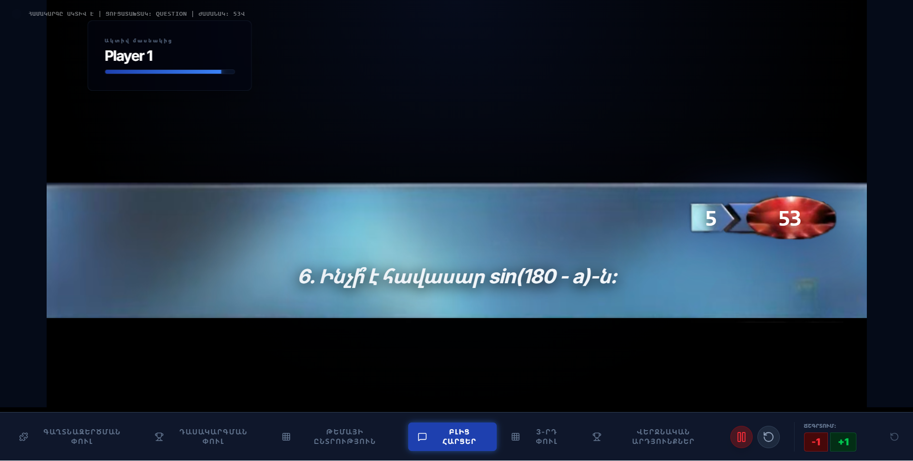
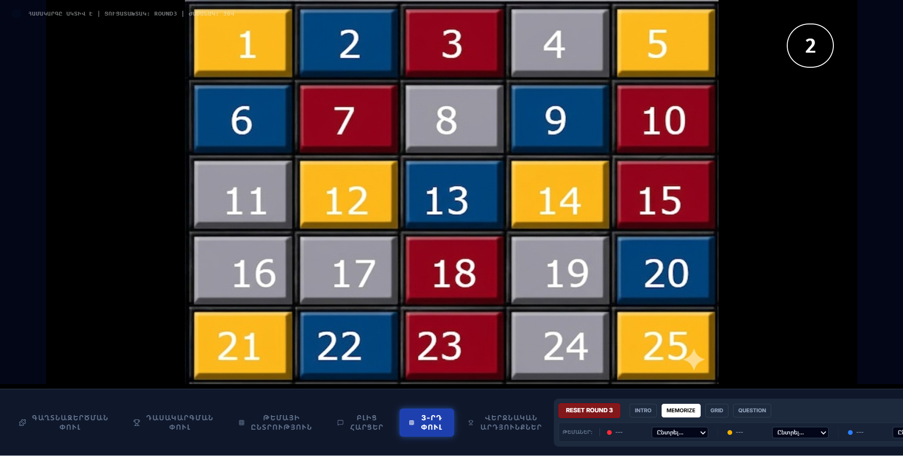

# Ամենախելացին (Britain's Brainiest) - Game Guide

**Live Website:** [https://amenakhelacin-project.vercel.app/](https://amenakhelacin-project.vercel.app/)

## 🖼️ Visual Preview

  
  
   
  
  
   
  

This application is a broadcast-quality dashboard for the "Britain's Brainiest" format. It is designed to be projected onto a screen for an audience, while a moderator controls the flow from a computer using the hidden **Moderator Panel**.

## 🔐 Accessing the Moderator Panel

1.  **Login**: Open the application and look for the login section.
2.  **Credentials**: Use `admin` as the username and `admin` as the password.
3.  **Purpose**: This panel allows you to skip rounds, toggle timers, reveal answers, and adjust scores.

---

## 🎮 Game Flow & Instructions

### Stage 1: The Entrance (Puzzle Round)
**Objective**: Determine the order of players by solving a logic puzzle.

-   **System**: The moderator clicks "Start Round" to show a 3x3 pattern.
-   **IRL**: Players observe the pattern.
-   **System**: The moderator triggers the "Solving" state.
-   **IRL**: Players must solve the puzzle (e.g., finding the sequence or missing piece) and answer orally or on paper.
-   **Moderator Control**: Once the order is determined IRL, the moderator proceeds to the **Ranking View** or **Round 2**.

### Stage 2: The Blitz (Topic Round)
**Objective**: Players choose a topic and answer as many questions as possible in 60 seconds.

-   **Topic Selection**:
    -   **System**: A grid of 6 topics is displayed.
    -   **Moderator Control**: Select the player currently choosing (e.g., Player 1).
    -   **IRL**: The player vocally chooses a topic.
    -   **System**: The moderator clicks the chosen topic to enter the Blitz screen.
-   **The Blitz**:
    -   **System**: A 60-second timer appears with the player's name and topic.
    -   **Moderator Control**: Press the **Play** button (or Spacebar/Moderator shortcut) to start the music and countdown.
    -   **IRL**: The moderator reads questions from their own list or the screen. The player answers as fast as they can.
    -   **Score Keeping (CRITICAL)**: The moderator must manually increment the score (+1) for every correct answer using the moderator panel buttons.
-   **Transition**: After all players have completed their blitz, check the **Ranking View** to see who moves to the final.

### Stage 3: The Specialist Grid (Final Round)
**Objective**: A memory-based grid challenge where colors represent different point values.

-   **Phase 1: Rules & Intro**:
    -   **System**: Play the Round 3 Intro audio.
-   **Phase 2: Memorization**:
    -   **System**: A 5x5 grid (25 cells) is shown with various colors. 
        -   **Yellow/Red/Blue**: Specific players' specialist topics (+2 points for them, +1 for others).
        -   **White**: General knowledge (+1 point).
        -   **Pink**: Prize/Bonus (+2 points for everyone).
    -   **Timer**: Players have a few seconds to memorize the positions of their colors.
-   **Phase 3: The Grid Game**:
    -   **IRL**: Players take turns choosing a number (1-25).
    -   **Moderator Control**: 
        1. Select the current player picker in the panel.
        2. Click the specific number on the grid to reveal it.
        3. Listen to the player's answer IRL.
        4. Use the panel's **Correct** or **Wrong** buttons to reveal the cell color and update scores automatically.
-   **Winner**: Once the grid is cleared or the game ends, move to the **Final Ranking** to announce the "Brainiest" winner.

---

## 🛠️ Interaction Breakdown

| Feature | System Access (Screen) | Real-Life (IRL) Interaction |
| :--- | :--- | :--- |
| **Questions** | Questions are displayed on the moderator screen. | Moderator reads them aloud. |
| **Answers** | No text input for answers. | Players speak their answers. |
| **Timers** | 60s (Blitz) and Round 3 memory timers. | Players must respect the digital clock. |
| **Scoring** | Automated in Round 3; Manual (+1/-1) in Round 2. | Moderator judge answers as Correct/Wrong. |
| **Music** | Synchronized with timers and round changes. | Silence is expected from the audience during Blitz. |

## ⌨️ Moderator Dashboard Shortcuts

### Global / Universal
-   **Reload**: Use the panel's Rotate/Reload icon to reset the current view if needed.
-   **Manual Score**: Use the `+1` / `-1` buttons next to the active player's name at any time.

### Stage 1: Puzzle Round
-   **Enter**: Starts the "Codebreaker" solving music and timer. If the timer is already running, pressing Enter again skips to the Ranking view.

### Stage 2: Blitz (Topic Round)
-   **Phase: Question View**:
    -   **"1" Key**: Mark answer as **CORRECT** (+1 point).
    -   **"2" Key**: Mark answer as **WRONG** (0 points).
    -   **Enter (After Time-Out)**: Finishes the player's turn and returns to the topic selection grid (or moves to the final ranking if no players are left).

### Stage 3: Specialist Grid (Final Round)
-   **Phase: Intro**:
    -   **Enter**: Starts the 10-second memorization timer.
-   **Phase: Grid (Selecting Number)**:
    -   **0-9 Keys**: Type the cell number (1-25) into the hidden buffer.
    -   **Backspace**: Deletes the last digit of the selection OR hides a revealed cell if it's currently active on the stage.
    -   **Enter**: Reveals the typed cell number (or advances to the question view if a cell is already revealed).
-   **Phase: Question**:
    -   **Enter**: Starts the 10-second question timer.
    -   **"1" Key**: Mark as **CORRECT**. Automatically adds points based on topic type (3 for specialist, 2 for opponent, 1 for general knowledge) and moves to the next turn.
    -   **"2" Key**: Mark as **WRONG**. Closes the question with 0 points and moves to the next turn.

